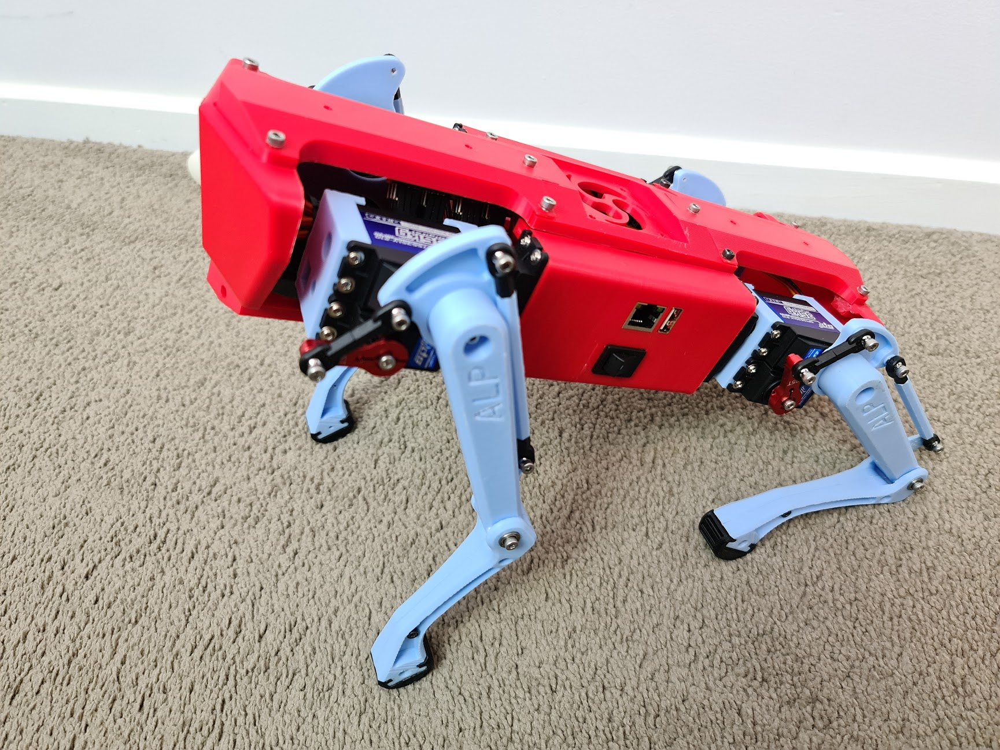

# robodog - the noob friendly quadruped robot



### Credits: 

Some design and code based on work by these guys:

- "Baris ALP" - https://grabcad.com/library/diy-quadruped-robot-1
- "[Jack Demeter](https://github.com/JackDemeter)" https://grabcad.com/library/quadruped-robot-w-code-1

## Overview

I attempted to learn ROS starting from zero experience with robotic development and found it to be way more complicated than I was prepared to deal with learning at the time. If you wish to operate a robot like this *properly*, you should really a) build a robot with closed-loop motor control, ie. not using R/C servos, and b) learn to create a physic simulation (for ROS, that would be in Gazebo, as far I could tell) and have ROS operate your robot's motors based on actual physical simulation and accelerometer data.

In layman's terms, the code in this repo lets you control the robot and walk it around, but it's really just playing a fixed animation of the legs rather than 'knowing' how to walk.

I wrote my code in NodeJS. I had extreme difficulty and ultimately failed getting other projects to run on the OrangePi Zero LTS due to python dependencies and differences between the distros which can be a nightmare at the best of times. Not having a real Rpi handy, nor being prepared to buy one for the sake of Python, nor wanting to change the robot design to accommodate it, I went with NodeJS. As a front-end dev this was natural to me. Use of Node reduces the only real compatibility challenges for other people using this repo to surfacing an i2c interface to talk to the PWM controller.

## Assembly

This is the easy part! I'll add physical build instructions soon.

## Electronics Required

- OrangePi Zero LTS, or other Rpi / OrangePi board (untested)
- PCA9685 16-channel 12-bit PWM driver (Adafruit)
- 10x Servos
  - I used `SPT5535LV-210` Servos from Aliexpress. They're digital metal-gear units with 200&deg; rotation and a pulse width of 500&micro;s - 2500&micro;s.
  - There were many options to choose from; I selected both the 35kg rating (higher torque gearing reduces rotation speed) and included the optional red anodized aluminium arm, which I used.
  - Be aware if you stall these servos and have a powerful enough supply of current, they will burn very quickly. Make sure your robot is assembled and the servos properly positioned before you attach the legs.

Instead of using a regulator, I opted to power my servos directly from the battery, which is 2x 18650 cells in series for a nominal 7.4V. The servos I used are fine with this voltage and I imagine most will be as it's standard practice to power servos from a 2S LiPo in R/C cars. The robot runs for at least an hour on a single charge, so they seem to be plenty.

## Bill of Materials

Will update with complete list once the project is mature.

<details>
(draft)

- Orange Pi Zero
- Rocker switch - local electronics store
- 12x spt5435LV
- 2x dc-dc SZBK07 (* I did not use these. heavy!)
- 2x 18650 (I used Sony VTC6)
- battery indicator - choose to suit your battery configuration and chemistry
- 50X50X10mm fan
- 16x 5mm R/C tie rod end (HPI)
- 8x 603ZZ 3x9x5mm bearings
- You would need a 5v regulator to power the Orange Pi
- Assorted length M3 bolts and nyloc nuts

</details>

## Installation

Check that i2c is enabled for your board. For OrangePi and possibly other Armbian boards, run `sudo armbian-config`, select `System (System and security settings)` then `Hardware (Toggle hardware configuration)`, and mark i2c0 to enable it. Select save and you'll be prompted to reboot your OrangePi.

- Clone the repo
- run `npm install`
- edit `config.js`
  - set the pin assignments for your Servos to the PCA9685 PWM controller
  - set `calibrate: true` so your servos are in centre position to attach the legs
  - under pca9685, the `i2cDevice` value corresponds to your device in linux, eg. for `/dev/i2c0` or `/dev/i2c-0` you would set this to `0`. (use `ls -l /dev/i2c*` to check. If not found, you need to enable i2c for your board)  
- run `node robot.js` or use `npm run start`
- access the page at `http://<device IP>:3000` and use the buttons or WASD to control the robot

**Note about hardware dependencies:**

Hardware-specific dependencies are set as optional in `package.json`:
```json
{ "optionalDependencies": {
    "i2c-bus": "^5.2.3",
    "pca9685": "^5.0.0"
}}
```
You can therefore do the install on a desktop OS and run the software, but i2c and the PCA9685 will be simulated and do nothing - you will see a message in console to confirm whether or not the hardware dependencies are OK or being simulated. All of the kinematic calculations are still executed so this was handy for development.

## Gait Visualisation

run `node visualise.js` to see the gait visualised on a 3D plot

Edit `visualise.js` to modify which gait file is visualised (default `gaits/basic.js`)

## Development Status

Overall status

See related Git project for planned and in-progress features: https://github.com/users/Energiz3r/projects/2

I'm absolutely useless when it comes to 3D modelling. The parts I've modified were done so in [123D Design](https://autodesk-123d-design.en.lo4d.com/windows), a discontinued piece of *very* basic software from Autodesk. If you want proper design files you'll need to make / convert them yourself. Contributions of all kind are welcome, but conversion of the 3D files to proper CAD format especially so.
